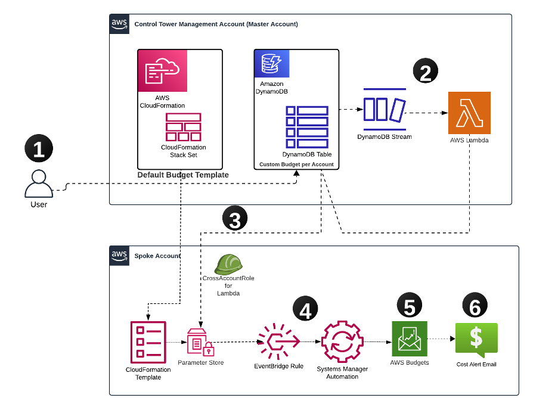

# Event-Driven Budget Management on AWS: Automating Cost Control Across Multi-Account Environments

This solution provides an automated and scalable approach to manage AWS budgets across multiple accounts in your organization. By leveraging AWS services like DynamoDB, Lambda, SSM Parameter Store, and AWS Budgets, you can centrally manage budgets with automated notifications when accounts approach or exceed their allocated thresholds.

## Solution Overview

Our solution implements an event-driven architecture that automates budget management across your AWS organization. The process starts in the management account, where account-specific budgets are defined and stored in an Amazon DynamoDB table. AWS Lambda functions automatically propagate these budget configurations to individual accounts through their respective AWS Systems Manager (SSM) Parameter Stores. AWS Budgets monitors spending in real-time, triggering email notifications when accounts approach or exceed their allocated thresholds.

## Components of the Solution

### Management Account Resources
- **Amazon DynamoDB Table**: Stores the budget information for each linked account
- **AWS Lambda Function**: Triggered by updates to the DynamoDB table and updates budgets in spoke accounts using AWS Systems Manager
- **IAM Roles**: Provides necessary permissions for cross-account access

### Spoke Account Resources
- **AWS SSM Parameter Store**: Holds the updated budget value
- **Amazon EventBridge Rules**: Trigger automation when the SSM parameter is updated
- **AWS Budgets**: Manages the account's cost based on these parameters
- **Email Notifications**: Sends alerts if budget thresholds are exceeded

## Workflow

1. **Update DynamoDB Table**: The user updates the budget value for a linked account in the DynamoDB table located in the management account
2. **DynamoDB Stream Trigger**: This update triggers a DynamoDB stream, which in turn triggers the Lambda function
3. **Lambda Updates SSM Parameter**: The Lambda function reads the updated budget value, assumes a cross-account role, and updates the SSM Parameter Store in the spoke account
4. **EventBridge Rule Trigger**: When the SSM Parameter Store is updated, an EventBridge Rule triggers the SSM Automation document
5. **AWS Budgets Update**: The SSM Automation document reads the updated budget value and updates AWS Budgets accordingly
6. **Email Notifications**: When spending reaches configured thresholds, the system sends notifications to designated stakeholders

## Prerequisites

- **AWS Account Setup**
  - AWS Organizations or AWS Control Tower with multi-account structure
  - Management account
  - At least one spoke account

- **Required Access to AWS Services**
  - AWS Budgets
  - AWS Lambda
  - Amazon DynamoDB
  - AWS Systems Manager
  - Amazon CloudWatch
  - AWS CloudFormation

- **Access Requirements**
  - **Management Account**
    - AWS CloudFormation deployment permissions
    - Amazon DynamoDB table management access
    - AWS Lambda function and CloudWatch logs monitoring
    - Cross-account IAM role management
  - **Spoke Accounts**
    - AWS CloudFormation template deployment permissions
    - Read-only access to monitor EventBridge rules, SSM parameters and automations, and AWS Budgets
  - Email address for budget notifications

## Deployment Steps

### 1. Deploy the Management Account Stack

In the management account, deploy the `budget_master_account.yaml` CloudFormation Stack:

- This template will deploy:
  - An Amazon DynamoDB table that stores budget values for each spoke account
  - An AWS Lambda function triggered by the DynamoDB stream
  - IAM roles with necessary permissions for cross-account access

### 2. Deploy Spoke Account Stack

You can set up the spoke account stack in one of the following ways:

- **Option 1**: Deploy the `budget_spoke_account.yaml` CloudFormation Stack directly in each spoke account
- **Option 2**: Use AWS CloudFormation StackSets from the management account to deploy across multiple spoke accounts

### 3. Update the DynamoDB Table

After deploying the solution:
- Access the management account
- Navigate to the DynamoDB table named 'BlogBudgetsDynamoDB'
- For each spoke account, add a new item:
  - 'AccountId': Enter the 12-digit spoke account ID
  - 'BudgetValue': Set the desired budget amount (as a number)

Example entry:
- AccountId: 123456789012
- BudgetValue: 1000

### 4. Solution Operation

When you update the budget value for an account, the budget limit in AWS Budgets is updated accordingly. Important notes about alerts:

- Even if you update the budget value after an alert has been triggered, the alert status remains in its triggered state
- It can take up to 8 hours for the new budget status to reflect in the alert system
- Alert state is based on actual spending and the initial budget limit at the time of the alert

## CloudFormation Template Parameters

### Management Account Template (`budget_master_account.yaml`)
- `SSMBudgetParameter`: SSM parameter path for budget values (Default: "/BlogBudgets/CostThreshold")
- `SpokeRoleName`: Name of the role to assume in spoke accounts (Default: "BlogBudgetsSpokeRole")

### Spoke Account Template (`budget_spoke_account.yaml`)
- `ManagementAccountId`: AWS Account ID of the management account
- `EmailRecipient`: Email address for budget notifications
- `BlogBudgetsSSMParameterName`: SSM Parameter name storing the budget value (Default: "/BlogBudgets/CostThreshold")
- `BlogBudgetsName`: Name of the AWS Budget
- `BlogBudgetsSpokeRoleName`: Name for the Spoke Account IAM role (should match the SpokeRoleName in Management Account Template)
- `BlogBudgetsAutomationRoleName`: Name for the automation role in the spoke account

## Cleaning Up

To avoid incurring future charges, delete the resources deployed by deleting the CloudFormation stacks in both management and spoke accounts.

## Future Enhancements

### Enable Remediation Actions
Implement AWS Budget Actions to automatically trigger responses when budget thresholds are exceeded:
- Apply custom IAM policies to restrict resource creation
- Target specific instances for shutdown when budgets are breached
- Implement automated cost optimization responses

### Integrate with ServiceNow for ITSM Workflow Automation
- Automatically create tickets or incidents when budget thresholds are exceeded
- Trigger predefined workflows in ServiceNow for cost optimization
- Streamline communication between financial and operational teams

## Security

See [CONTRIBUTING](CONTRIBUTING.md#security-issue-notifications) for more information.

## License

This library is licensed under the MIT-0 License. See the LICENSE file.

## About the Authors

**Gautam Bhaghavatula** - AWS Senior Partner Solutions Architect with expertise in cloud infrastructure architecture, security, systems, networking, microservices, and DevOps.

**Matt Saeger** - Senior Delivery Consultant at AWS who drives strategic cloud initiatives and leads enterprise-scale transformations for financial services customers, holding 11 AWS certifications.
