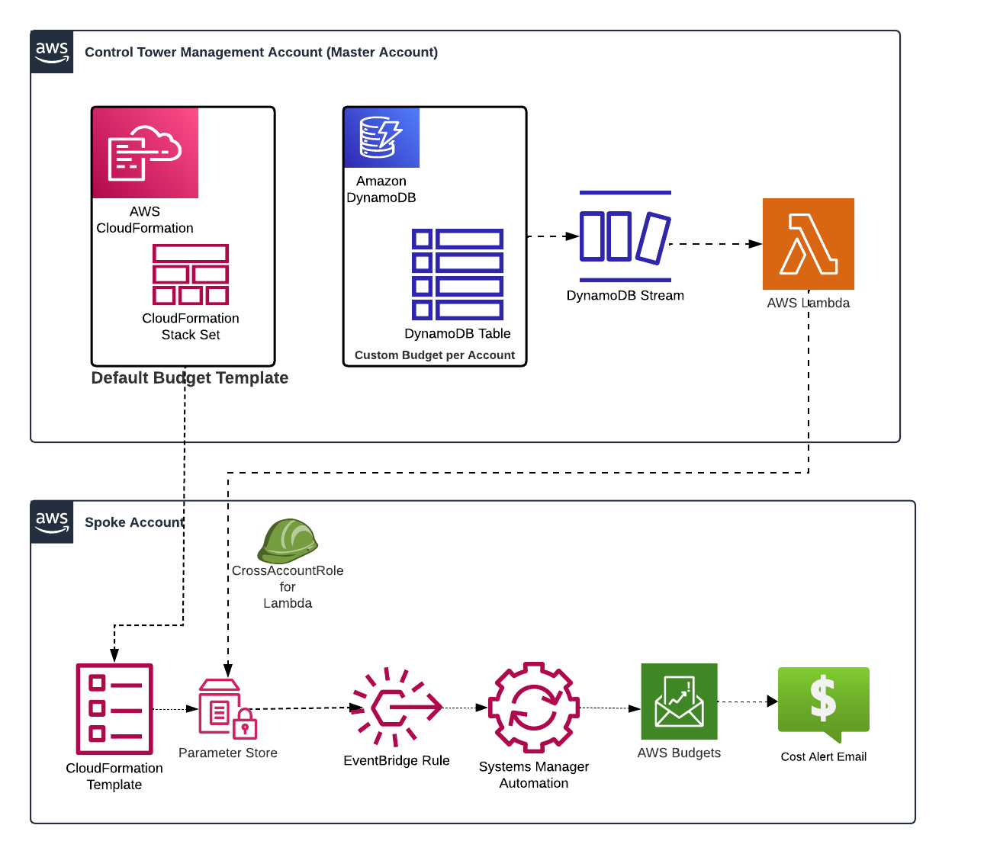

## Event-Driven Budget Management on AWS

This solution provides code to implement an automated budget management system across multiple AWS accounts using CloudFormation templates. Whether you're using AWS Control Tower or AWS Organizations, this solution provides a scalable approach to cloud financial management that adapts to your organization's needs.

The following figure provides an overview of the solution:

## Implementation Components

The solution consists of the following key components:

### Management Account Resources (budget_master_account.yaml)
- DynamoDB table to store budget values for each account
- Lambda function that processes DynamoDB stream events
- IAM roles for cross-account access

### Spoke Account Resources (budget_spoke_account.yaml)
- AWS Budget resource with configurable thresholds
- SSM Parameter Store integration
- EventBridge rules for budget updates
- Required IAM roles for automation

## Deployment Parameters

### Management Account Template
- `SSMBudgetParameter`: SSM parameter path for budget values
- `SpokeRoleName`: Name of the role to assume in spoke accounts

### Spoke Account Template
- `ManagementAccountId`: AWS Account ID of the management account
- `EmailRecipient`: Email address for budget notifications
- `BlogBudgetsThreshold`: Default budget threshold value
- `BlogBudgetsName`: Name of the AWS Budget
- `BlogBudgetsThreshold`: Default budget threshold value
- `BlogBudgetsSpokeRoleName`: Name for the Spoke Account IAM role.  This should match the SpokeRoleName provided in the Management Account Template.
- `BlogBudgetsAutomationRoleName`: Name for the automation role in the spoke account

## Deployment Steps

### Prerequisites
- AWS Management Account with administrative access
- One or more AWS spoke accounts
- AWS Console access to both management and spoke accounts

### Management Account Deployment
1. Download the `budget_master_account.yaml` template
2. Navigate to the AWS CloudFormation console in your management account
3. Click "Create stack" and choose "With new resources (standard)"
4. Upload the template file and click "Next"
5. Enter stack details:
   - Stack name: e.g., "budget-management"
   - SSMBudgetParameter: "/BlogBudgets/CostThreshold" (or your preferred path)
   - SpokeRoleName: "BlogBudgetsSpokeRole" (note this for spoke account setup)
6. Click "Next", review the configuration, and create the stack
7. Wait for stack creation to complete (approximately 5 minutes)

### Spoke Account Deployment
1. Download the `budget_spoke_account.yaml` template
2. Navigate to the AWS CloudFormation console in your spoke account
3. Click "Create stack" and choose "With new resources (standard)"
4. Upload the template file and click "Next"
5. Enter stack details:
   - Stack name: e.g., "budget-spoke"
   - ManagementAccountId: Your management account ID (12-digit number)
   - EmailRecipient: Email address for budget notifications
   - BlogBudgetsThreshold: Initial budget amount (e.g., "1000")
6. Click "Next", review the configuration, and create the stack
7. Wait for stack creation to complete (approximately 5 minutes)

### Validation Steps
1. In the management account:
   - Verify the DynamoDB table "BlogBudgetsDynamoDB" is created
   - Confirm the Lambda function "BlogBudgetsUpdateLambda" is deployed
2. In the spoke account:
   - Check that the SSM parameter exists with the specified budget value
   - Verify the AWS Budget is created with the correct threshold

## Error Handling

Common errors and resolutions:
- Budget amount validation errors: Ensure budget values are valid numeric values
- Cross-account access errors: Verify IAM roles and trust relationships are properly configured
- SSM Parameter updates: Confirm proper permissions for parameter updates in spoke accounts

## Security

See [CONTRIBUTING](CONTRIBUTING.md#security-issue-notifications) for more information.

## License

This library is licensed under the MIT-0 License. See the LICENSE file.

