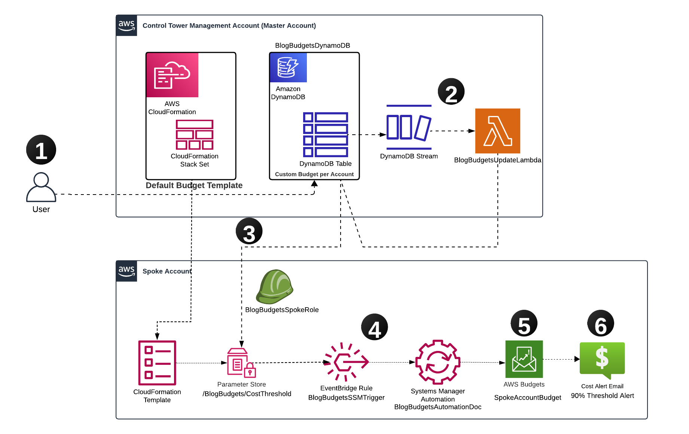

# Event-Driven Budget Management on AWS: Automating Cost Control Across Multi-Account Environments

This solution provides an automated and scalable approach to manage AWS budgets across multiple accounts in your organization. By leveraging AWS services like Amazon DynamoDB, AWS Lambda, AWS Systems Manager Parameter Store, and AWS Budgets, you can centrally manage budgets with automated notifications when accounts approach or exceed their allocated thresholds.

## Solution Overview

Our solution implements an event-driven architecture that automates budget management across your AWS organization. The process starts in the management account, where account-specific budgets are defined and stored in an Amazon DynamoDB table. AWS Lambda functions automatically propagate these budget configurations to individual accounts through their respective AWS Systems Manager Parameter Stores. AWS Budgets monitors spending in real-time, triggering email notifications when accounts approach or exceed their allocated thresholds.

## Components of the Solution

### Management Account Resources
- **Amazon DynamoDB Table (BlogBudgetsDynamoDB)**: Stores the budget information for each linked account
- **AWS Lambda Function (BlogBudgetsUpdateLambda)**: Triggered by updates to the Amazon DynamoDB table and updates budgets in spoke accounts using AWS Systems Manager
- **AWS Identity and Access Management (IAM) Roles**:
  - **BlogBudgetsLambdaRole**: Provides necessary permissions for AWS Lambda to access Amazon DynamoDB and assume cross-account roles

### Spoke Account Resources
- **AWS Systems Manager Parameter Store (/BlogBudgets/CostThreshold)**: Holds the updated budget value
- **Amazon EventBridge Rule (BlogBudgetsSSMTrigger)**: Triggers automation when the AWS Systems Manager parameter is updated
- **AWS Systems Manager Automation Document (BlogBudgetsAutomationDoc)**: Executes the budget update process
- **AWS Budgets (SpokeAccountBudget)**: Manages the account's cost based on these parameters and triggers notifications at 90% of the budget threshold
- **AWS Identity and Access Management (IAM) Roles**:
  - **BlogBudgetsSpokeRole**: Allows the management account Lambda to update AWS Systems Manager parameters
  - **BlogBudgetsAutomationRole**: Allows Amazon EventBridge and AWS Systems Manager to execute automation
- **Email Notifications**: Sends alerts if budget thresholds are exceeded

## Workflow

1. **Update Amazon DynamoDB Table**: The user updates the budget value for a linked account in the Amazon DynamoDB table (BlogBudgetsDynamoDB) located in the management account.
2. **Amazon DynamoDB Stream Trigger**: This update triggers an Amazon DynamoDB stream, which in turn triggers the AWS Lambda function (BlogBudgetsUpdateLambda) in the management account.
3. **AWS Lambda Function Updates AWS Systems Manager Parameter**: The AWS Lambda function reads the updated budget value from the Amazon DynamoDB table, assumes a cross-account role (BlogBudgetsSpokeRole), and updates the AWS Systems Manager Parameter Store (/BlogBudgets/CostThreshold) in the spoke account with the new budget value.
4. **Amazon EventBridge Rule Trigger**: When the AWS Systems Manager Parameter Store in the spoke account is updated, an Amazon EventBridge Rule (BlogBudgetsSSMTrigger) triggers the AWS Systems Manager Automation document (BlogBudgetsAutomationDoc) in the spoke account.
5. **AWS Budgets Update**: The AWS Systems Manager Automation document in the spoke account reads the updated budget value from the AWS Systems Manager Parameter Store and updates the AWS Budgets (SpokeAccountBudget) value accordingly.
6. **Email Notifications**: When spending reaches configured thresholds (90% of the budget by default), the system sends informational notifications to designated stakeholders.

## Prerequisites

- **AWS Account Setup**
  - AWS Organizations or AWS Control Tower with multi-account structure
  - Management account
  - At least one spoke account

- **Required Access to AWS Services**
  - AWS Budgets
  - AWS Lambda
  - Amazon DynamoDB
  - AWS Systems Manager
  - Amazon CloudWatch
  - AWS CloudFormation

- **Access Requirements**
  - **Management Account**
    - AWS CloudFormation deployment permissions
    - Amazon DynamoDB table management access
    - AWS Lambda function and Amazon CloudWatch logs monitoring
    - Cross-account AWS Identity and Access Management (IAM) role management
  - **Spoke Accounts**
    - AWS CloudFormation template deployment permissions
    - Read-only access to monitor Amazon EventBridge rules, AWS Systems Manager parameters and automations, and AWS Budgets
  - Email address for budget notifications

## Deployment Steps

### 1. Deploy the Management Account Stack

In the management account, deploy the `budget_mgmt_account.yaml` AWS CloudFormation Stack:

1. Sign in to the AWS Management Console in your management account
2. Navigate to the AWS CloudFormation console
3. Click "Create stack" and choose "With new resources (standard)"
4. Select "Upload a template file" and upload the `budget_mgmt_account.yaml` file
5. Click "Next"
6. Enter a stack name (e.g., "budget-management")
7. Configure the stack parameters:
   - `SSMBudgetParameter`: Path for the AWS Systems Manager parameter (default: "/BlogBudgets/CostThreshold")
   - `SpokeRoleName`: Name of the role to assume in spoke accounts (default: "BlogBudgetsSpokeRole")
8. Click "Next", review the configuration, and create the stack
9. Wait for stack creation to complete (approximately 5 minutes)

This template will deploy:
- An Amazon DynamoDB table (BlogBudgetsDynamoDB) that stores budget values for each spoke account
- An AWS Lambda function (BlogBudgetsUpdateLambda) triggered by the Amazon DynamoDB stream
- AWS Identity and Access Management (IAM) roles (BlogBudgetsLambdaRole) with necessary permissions for cross-account access

### 2. Deploy Spoke Account Stack

You can set up the spoke account stack in one of the following ways:

#### Option 1: Deploy Directly in Each Spoke Account

1. Sign in to the AWS Management Console in your spoke account
2. Navigate to the AWS CloudFormation console
3. Click "Create stack" and choose "With new resources (standard)"
4. Select "Upload a template file" and upload the `budget_spoke_account.yaml` file
5. Click "Next"
6. Enter a stack name (e.g., "budget-spoke")
7. Configure the stack parameters:
   - `ManagementAccountId`: Enter the 12-digit AWS account ID of your management account
   - `EmailRecipient`: Enter the email address to receive budget notifications
   - Other parameters can use their default values or be customized as needed
8. Click "Next", review the configuration, and create the stack
9. Wait for stack creation to complete (approximately 5 minutes)

#### Option 2: Use AWS CloudFormation StackSets

For deploying across multiple spoke accounts:

1. Sign in to the AWS Management Console in your management account
2. Navigate to the AWS CloudFormation console
3. Click on "StackSets" in the left navigation pane
4. Click "Create StackSet"
5. Select "Upload a template file" and upload the `budget_spoke_account.yaml` file
6. Click "Next"
7. Enter a StackSet name (e.g., "budget-spoke-stackset")
8. Configure the parameters as in Option 1
9. Click "Next"
10. Choose your deployment options (AWS Organizations or specific accounts)
11. Select the target accounts and regions
12. Click "Next", review the configuration, and create the StackSet

### 3. Update the Amazon DynamoDB Table

After deploying the solution:
1. Access the management account
2. Navigate to the Amazon DynamoDB console
3. Select the table named 'BlogBudgetsDynamoDB'
4. Click on the "Items" tab
5. Click "Create item"
6. For each spoke account, add a new item:
   - 'AccountId' (String): Enter the 12-digit spoke account ID
   - 'BudgetValue' (Number): Set the desired budget amount
7. Click "Create item" to save

Example entry:
- AccountId: 123456789012
- BudgetValue: 1000

### 4. Verify Deployment

To verify that the solution is working correctly:

1. In the management account:
   - Confirm the Amazon DynamoDB table "BlogBudgetsDynamoDB" is created
   - Verify the AWS Lambda function "BlogBudgetsUpdateLambda" is deployed
   - Check the AWS CloudWatch Logs for the Lambda function to ensure it's executing without errors

2. In the spoke account:
   - Verify the AWS Systems Manager parameter "/BlogBudgets/CostThreshold" exists with the correct value
   - Confirm the AWS Budget "SpokeAccountBudget" is created with the expected threshold
   - Check that the Amazon EventBridge rule "BlogBudgetsSSMTrigger" is active

3. Test the solution:
   - Update a budget value in the Amazon DynamoDB table
   - Wait a few minutes for the changes to propagate
   - Verify that the AWS Budget in the spoke account has been updated

## Solution Operation

When you update the budget value for an account, the budget limit in AWS Budgets is updated accordingly. Important notes about alerts:

- Even if you update the budget value after an alert has been triggered, the alert status remains in its triggered state
- It can take up to 8 hours for the new budget status to reflect in the alert system
- Alert state is based on actual spending and the initial budget limit at the time of the alert
- By default, notifications are sent when spending reaches 90% of the budget threshold

## AWS CloudFormation Template Parameters

### Management Account Template (`budget_mgmt_account.yaml`)
- `SSMBudgetParameter`: AWS Systems Manager parameter path for budget values (Default: "/BlogBudgets/CostThreshold")
- `SpokeRoleName`: Name of the role to assume in spoke accounts (Default: "BlogBudgetsSpokeRole")

### Spoke Account Template (`budget_spoke_account.yaml`)
- `ManagementAccountId`: AWS Account ID of the management account
- `EmailRecipient`: Email address for budget notifications
- `BlogBudgetsSSMParameterName`: AWS Systems Manager Parameter name storing the budget value (Default: "/BlogBudgets/CostThreshold")
- `BlogBudgetsName`: Name of the AWS Budget (Default: "SpokeAccountBudget")
- `BlogBudgetsThreshold`: Default budget threshold value (Default: "1000")
- `BlogBudgetsSpokeRoleName`: Name for the Spoke Account AWS Identity and Access Management (IAM) role (Default: "BlogBudgetsSpokeRole")
- `BlogBudgetsAutomationRoleName`: Name for the automation role in the spoke account (Default: "BlogBudgetsAutomationRole")

## Troubleshooting

### Common Issues and Solutions

1. **Cross-Account Access Issues**:
   - **Symptom**: AWS Lambda function fails to update AWS Systems Manager parameters in spoke accounts
   - **Solution**: Verify that the BlogBudgetsSpokeRole in the spoke account has the correct trust relationship with the management account's BlogBudgetsLambdaRole

2. **Budget Updates Not Reflecting**:
   - **Symptom**: Updates to the Amazon DynamoDB table don't result in AWS Budget updates
   - **Solution**: Check AWS CloudWatch Logs for the AWS Lambda function to identify any errors. Verify that the Amazon EventBridge rule is correctly configured.

3. **Notification Issues**:
   - **Symptom**: Not receiving email notifications for budget thresholds
   - **Solution**: Verify that the email address is correct and that you've confirmed the subscription to AWS Budgets notifications

4. **Deployment Failures**:
   - **Symptom**: AWS CloudFormation stack creation fails
   - **Solution**: Review the stack events in the AWS CloudFormation console to identify the specific resource that failed and the reason for the failure

## Cost Implications

This solution uses several AWS services that may incur charges:

- **Amazon DynamoDB**: Minimal costs for the small table and stream usage
- **AWS Lambda**: Minimal costs for function invocations when budgets are updated
- **AWS Systems Manager**: No additional cost for parameter storage
- **Amazon EventBridge**: Minimal costs for rule evaluations
- **AWS Budgets**: Free for the first two budgets per account, then $0.02 per budget per day

The total cost of running this solution is typically less than $5 per month for a moderate number of accounts and budget updates.

## Security Considerations

- **Cross-Account Access**: This solution uses cross-account IAM roles with least privilege permissions
- **Data Encryption**: All data in Amazon DynamoDB and AWS Systems Manager Parameter Store is encrypted at rest
- **Access Control**: IAM roles are scoped to specific resources and actions
- **Logging and Monitoring**: AWS CloudWatch Logs capture AWS Lambda function execution details for auditing

For additional security information, see [CONTRIBUTING](CONTRIBUTING.md#security-issue-notifications).

## Regional Support

This solution has been tested in the following AWS regions:
- US East (N. Virginia) - us-east-1
- US West (Oregon) - us-west-2
- Europe (Ireland) - eu-west-1

It should work in any region that supports all the required services: Amazon DynamoDB, AWS Lambda, AWS Systems Manager, Amazon EventBridge, and AWS Budgets.

## Cleaning Up

To avoid incurring future charges, delete the resources deployed by following these steps:

### Management Account
1. Navigate to the AWS CloudFormation console
2. Select the stack you created (e.g., "budget-management")
3. Click "Delete" and confirm the deletion
4. Wait for the stack deletion to complete

### Spoke Accounts
1. Navigate to the AWS CloudFormation console in each spoke account
2. Select the stack you created (e.g., "budget-spoke")
3. Click "Delete" and confirm the deletion
4. Wait for the stack deletion to complete

If you used AWS CloudFormation StackSets:
1. Navigate to the AWS CloudFormation console in the management account
2. Click on "StackSets" in the left navigation pane
3. Select your StackSet (e.g., "budget-spoke-stackset")
4. Click "Delete stacks from StackSet"
5. Select all accounts and regions
6. Click "Delete stacks" and wait for completion
7. Once all stacks are deleted, select the StackSet again and click "Delete StackSet"

## Future Enhancements

### Enable Remediation Actions
Implement AWS Budget Actions to automatically trigger responses when budget thresholds are exceeded:
- Apply custom AWS Identity and Access Management (IAM) policies to restrict resource creation
- Target specific Amazon EC2 instances for shutdown when budgets are breached
- Implement automated cost optimization responses

### Integrate with ServiceNow for ITSM Workflow Automation
- Automatically create tickets or incidents when budget thresholds are exceeded
- Trigger predefined workflows in ServiceNow for cost optimization
- Streamline communication between financial and operational teams

## Security

See [CONTRIBUTING](CONTRIBUTING.md#security-issue-notifications) for more information.

## License

This library is licensed under the MIT-0 License. See the LICENSE file.

## About the Authors

**Gautam Bhaghavatula** - AWS Senior Partner Solutions Architect with expertise in cloud infrastructure architecture, security, systems, networking, microservices, and DevOps.

**Matt Saeger** - Senior Delivery Consultant at AWS who drives strategic cloud initiatives and leads enterprise-scale transformations for financial services customers, holding 11 AWS certifications.
